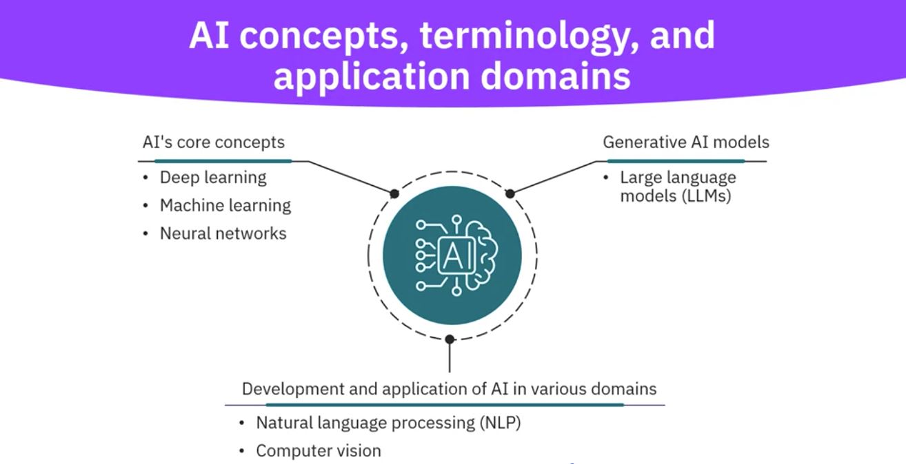

# AI-ML-Learning

## Usage of AI:

* Healthcare
* Fraud detection & prevention in finance
* Personal assistants (Alexa)
* Autonomous vechiles
* Streaming services (Netflix)
* Content generation (Chat GPT, Gemini)

## AI concepts, terminology and application domains

