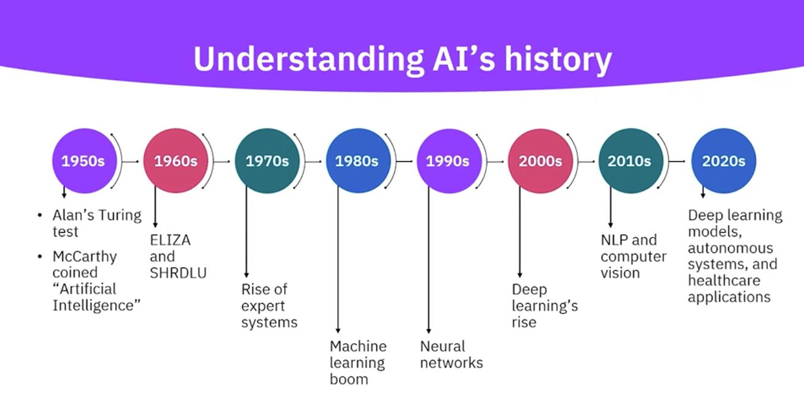
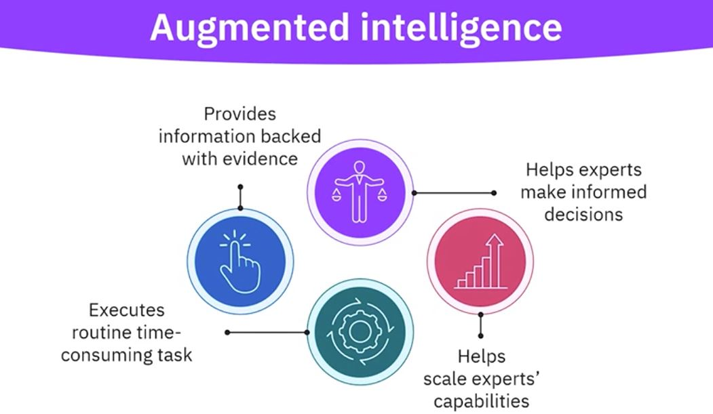

# AI-ML-Learning

## Usage of AI:

* Healthcare
* Fraud detection & prevention in finance
* Personal assistants (Alexa)
* Autonomous vechiles
* Streaming services (Netflix)
* Content generation (Chat GPT, Gemini)

## Business and career transformation through AI

* AI Engineering
* Data Science
* Robotics Engineering
* NLP Engineering
* AI Research

## AI concepts, terminology and application domains

## AI history

## What is AI ?

* Simulates human intelligence through computer systems
* Utilizes algorithms and data to function
* Enables machines to perform tasks requiring human intelligence
* Human Intelligence : Learning, Reasoning, Problem-solving, Decision-making

### AI is multi-disciplinary field : 

 Computer science + Electrical engineering => Software and Hardware
 
 Mathematics and Statistics => Viable models and measure performance
 
 Psychology and linguistics => Explain the functioning of AI
 
 Philosphy => Provide insights on intelligence and ethical considerations

## The digital revolution:

* Internet : revoulutionizes connectivity and enables faster access to information.
* Distributed computing : Scales data processing
* IOT : Generates a lot of data
* Social Networking : Fosters unstructured data

## Augmented Intelligence:

## Innate Intelligence:

* Intelligence that govern every activity in our body
* e.g. Evolution of an Oak tree from a seed, Evolution of an elephant from a single-celled organism

## How does AI learn ?

* We provide machines the ability to examine the examples and create machine-learning models based on inputs and desired outputs.
* We do's in different ways such as Supervised Learning, Unsupervised learning, Reinforcement learning

## Types of AI:

### Strength basis:

* Weak AI (narrow AI)
* Strong AI (generalized AI)
* Super AI (conscious AI)

## Weak AI (narrow AI):

* Applied AI, it can perform specific task but can't learn new ones.
* Decision making based on programmed alogorithms and training data.
* Eg. Language translators, Virtual assistants, AI-powered web searches, Recommendation engines, Intelligent spam filters

## Strong AI (generalized AI):

* An AI with diverese capabilities across unrelated tasks.
* Acquires new skills to face new challenges.
* Amalgamation of various AI startegies that learn from experience and can perform human level of intelligence
* Eg. Finance, Human resource, Information technology, Research and development (R&D), Supply chain.

## Super AI (conscious AI)

* AI with human level consciousness or beyond that.
* Requires self-awareness, showing cognitive abilities and developing its own thinking skills
* Eg. Healthcare, Autonomous vechiles, Robotics, Natural language understanding, Environment conservation

